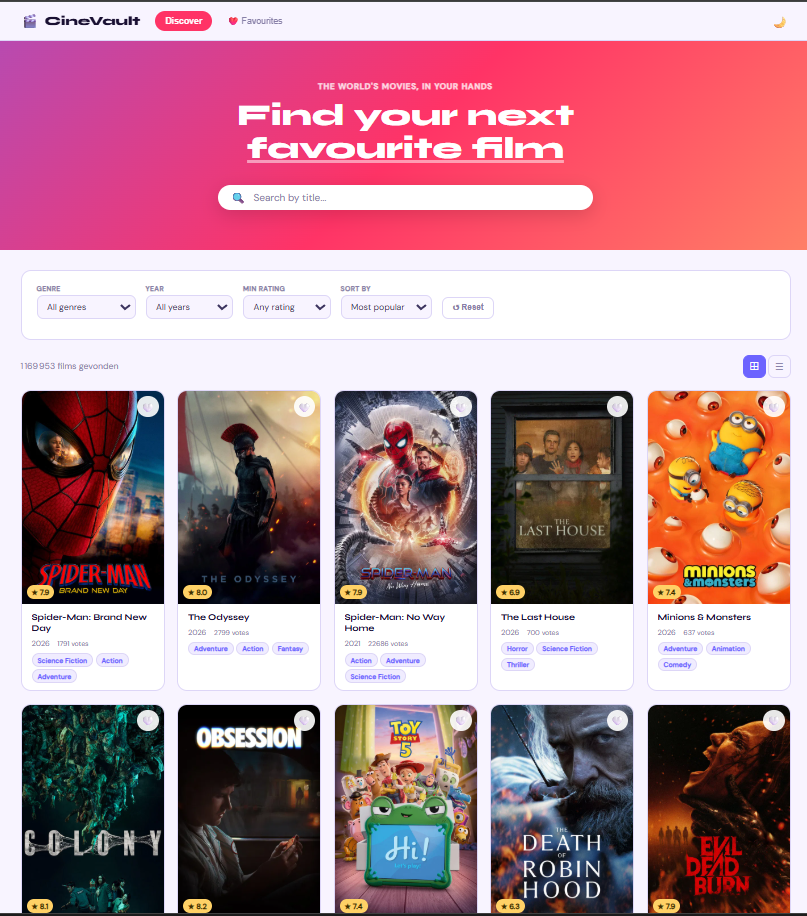
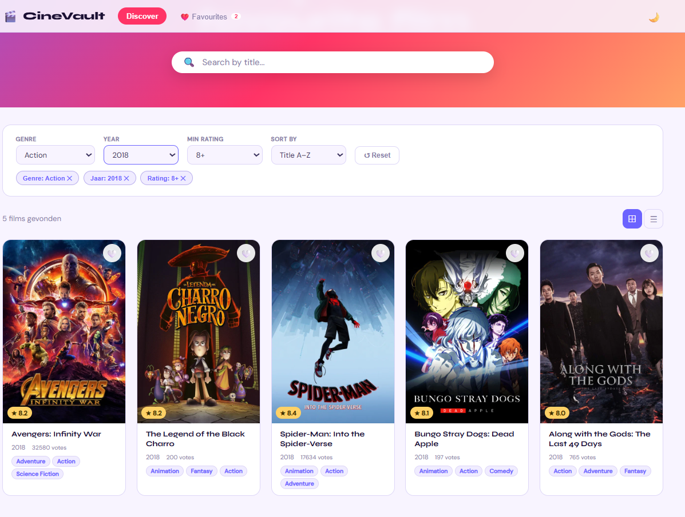
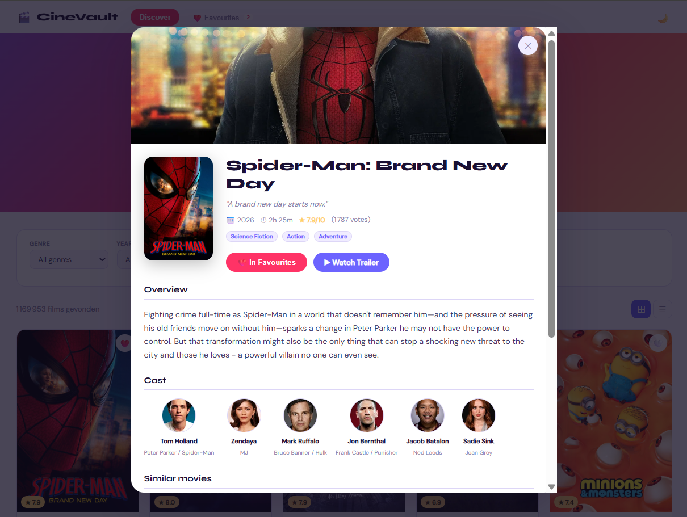
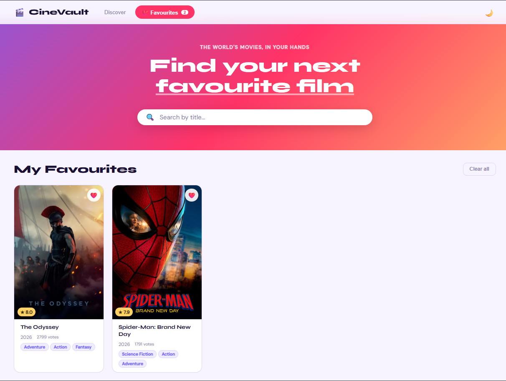
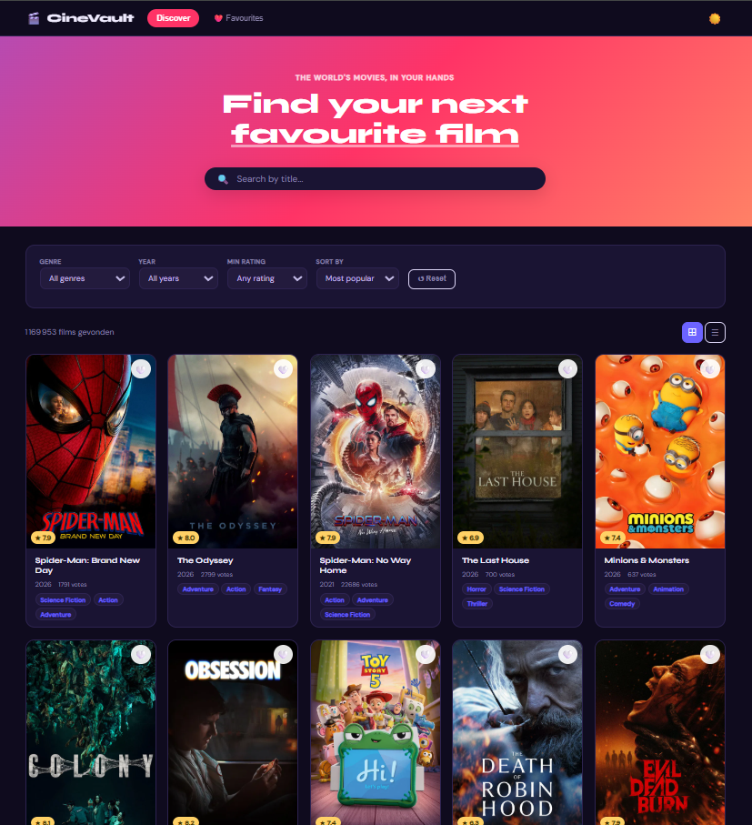
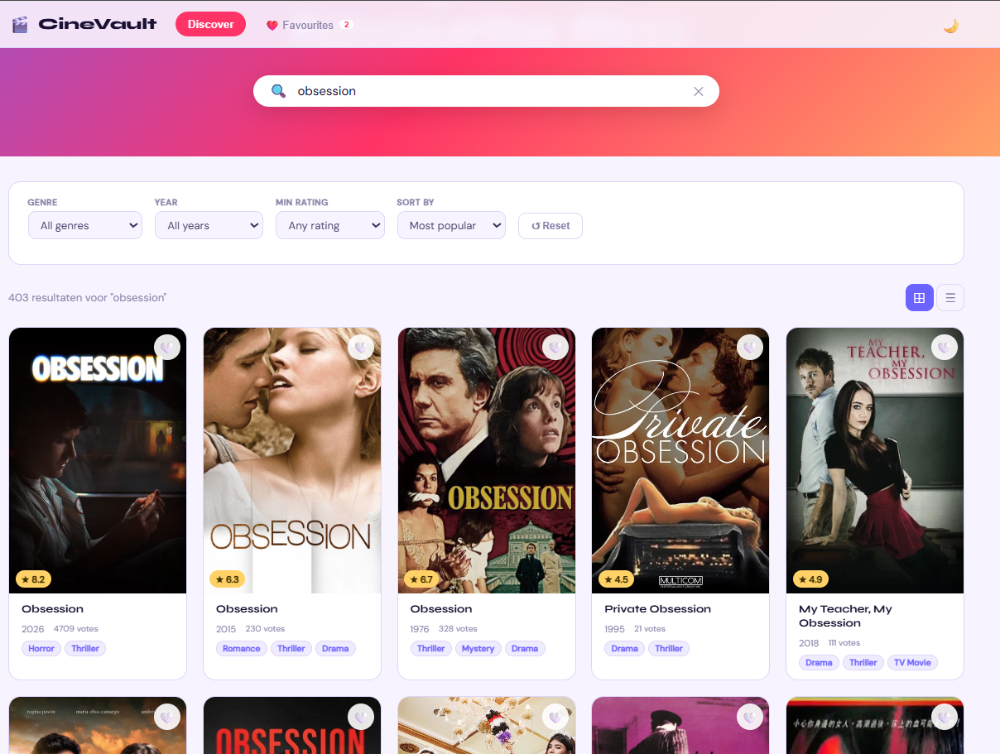

# 🎬 CineVault — Movie Explorer

Interactieve Single Page Applicatie gebouwd met Vite en Vanilla JavaScript die gebruik maakt van de TMDB API.

---

## 1. Projectbeschrijving en functionaliteiten

CineVault laat gebruikers films ontdekken, filteren en opslaan als favoriet.

- 🔍 Zoeken op filmtitel
- 🎭 Filteren op genre, jaar en minimale beoordeling
- 🔃 Sorteren op populariteit, rating of datum
- ❤️ Films opslaan als favoriet (blijft bewaard)
- 🌙 Dark mode (wordt onthouden)
- ⊞ Grid of lijstweergave
- 🎬 Filmdetails met cast, trailer en gerelateerde films
- 📄 Paginering door resultaten

---

## 2. Gebruikte API

**The Movie Database (TMDB)**
- Website: https://www.themoviedb.org
- Docs: https://developer.themoviedb.org/docs

Gebruikte endpoints:
- `GET /discover/movie` — films ophalen met filters
- `GET /search/movie` — zoeken op naam
- `GET /movie/{id}` — filmdetails met cast en trailer
- `GET /genre/movie/list` — lijst van alle genres

---

## 3. Technische vereisten

| Vereiste | Bestand | Lijn | Uitleg |
|---|---|---|---|
| **Elementen selecteren** | `src/js/main.js` | 30-50 | `document.getElementById` voor alle UI elementen |
| **Elementen manipuleren** | `src/js/main.js` | 110 | `.innerHTML` aanpassen voor movieGrid |
| **Events koppelen** | `src/js/main.js` | 170 | `addEventListener` op zoekbalk en knoppen |
| **Constanten** | `src/js/api.js` | 3-4 | `const BASE_URL` en `const API_KEY` |
| **Template literals** | `src/components/movieCard.js` | 25 | HTML opbouwen met backticks en `${}` |
| **Iteratie over arrays** | `src/js/main.js` | 112 | `.map()` over movies array |
| **Array methodes** | `src/js/storage.js` | 20 | `.filter()`, `.find()`, `.some()` |
| **Arrow functions** | `src/js/main.js` | overal | Alle callbacks als arrow functions |
| **Ternary operator** | `src/components/movieCard.js` | 8 | `movie.release_date ? ... : '—'` |
| **Callback functions** | `src/js/main.js` | 188 | `setTimeout(() => loadMovies(), 400)` |
| **Promises** | `src/js/api.js` | 18 | `fetch()` geeft een Promise terug |
| **Async & Await** | `src/js/main.js` | 82 | `async function loadMovies()` |
| **Observer API** | `src/js/main.js` | 270 | `IntersectionObserver` voor kaart animaties |
| **Fetch** | `src/js/api.js` | 18 | Data ophalen van TMDB |
| **JSON** | `src/js/api.js` | 23 | `.json()` en `JSON.parse` / `JSON.stringify` |
| **LocalStorage** | `src/js/storage.js` | 5 | Favorieten en voorkeuren bewaren |
| **Formulier validatie** | `src/js/main.js` | 188 | Lege zoekopdracht wordt niet verstuurd |
| **Flexbox** | `src/css/global.css` | 45 | Header layout |
| **CSS Grid** | `src/css/components.css` | 3 | Movie grid layout |
| **Vite** | `package.json` | — | Build tool en development server |

---

## 4. Installatiehandleiding

```bash
# Clone de repository
git clone https://github.com/MaherErh/CineVault.git

# Ga naar de map
cd CineVault

# Installeer dependencies
npm install

# Start de app
npm run dev
```

Open daarna **http://localhost:5173** in je browser.

---

## 5. Screenshots

### Hoofdpagina


### Filters


### Film detail


### Favorieten


### Dark mode


### Search film



---

## 6. Bronnen

- TMDB API documentatie: https://developer.themoviedb.org/docs
- MDN Web Docs: https://developer.mozilla.org
- Vite documentatie: https://vitejs.dev
- Google Fonts: https://fonts.google.com
- AI hulp: Claude (Anthropic) — hulp bij projectstructuur en code
- Chatlog: (https://claude.ai/share/8699ee8d-fec6-4db1-937b-9216df49fbdf)